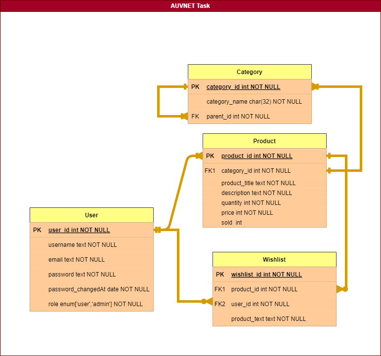
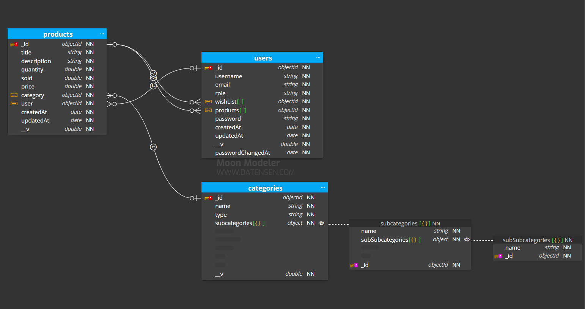

# AUVNET Internship Assessment

Here we go 💪🏻

## Installation

Here it's the way to start this project

#### 1) Clone Project

```bash
git clone https://github.com/MattySamy/AUVNET-Intrenship-Assessment.git
```

#### 2) Navigate to the project directory:

```bash
  cd AUVNET-Intrenship-Assessment
```

#### 3) Install Dependencies:

```bash
npm install
```

## Environment Variables

To run this project, you will need to add the following environment variables to your `config.env` file

`PORT=Your Desired PORT Number`

`NODE_ENV=development`

`DB_URI=mongodb+srv://<Your Username>:<Your Password>@cluster0.ws2xxnq.mongodb.net/<Your DB name>?retryWrites=true&w=majority`

`JWT_EXPIRES_IN=Duration in format ("nm => minutes","ns => seconds","ny" => year,"nd" => days)`

`JWT_REFRESH_EXPIRES_IN=Duration in format ("nm => minutes","ns => seconds","ny" => year,"nd" => days)`

`JWT_SECRET_KEY=Random Secret Key`

`JWT_REFRESH_SECRET_KEY=Random Secret Key`

## Usage

#### 1) Development mode with automatic restarts:

```bash
npm run start:dev
```

#### 2) Production mode:

```bash
npm run start:prod
```

### 3) Frontend Usage:

Please Run Every View Particularly or by navigator in any view u run and don't forget to run the backend server first.

## API Reference

[Postman Collection](https://interstellar-flare-148518.postman.co/workspace/Team-Workspace~4ba745de-4647-4ad5-893b-ad5d80170703/collection/23532006-6a4b2bbe-6ed9-44be-aa6b-1ac38135cb40?action=share&creator=23532006&active-environment=23532006-23e73f70-0d0f-4e96-85a2-299957ecbf7d)

## SQL Entity Relationship Diagram



## NoSQL Entity Relationship Diagram


